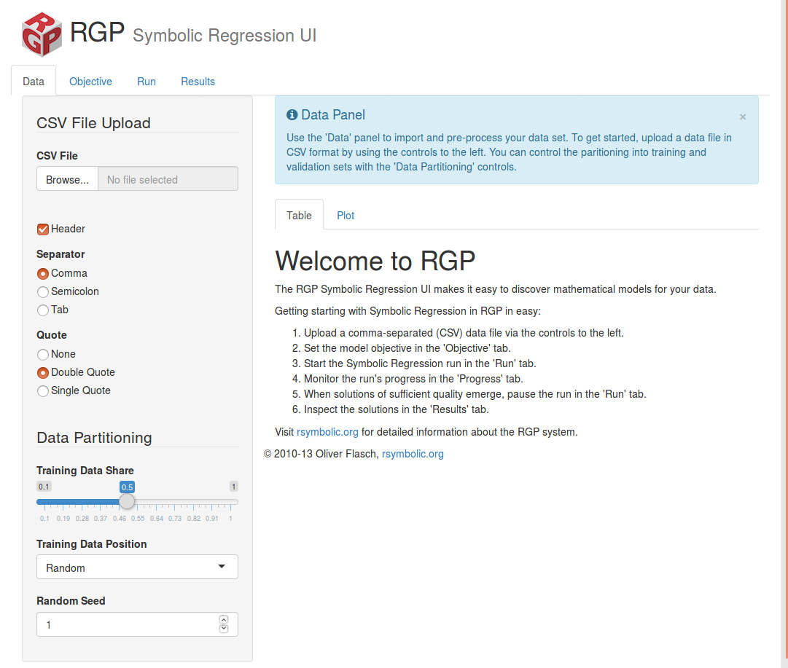

RGP is a R-based Genetic Programming implementation designed to address symbolic regression problems. It is under the umbrella of [Rsymbolic](http://rsymbolic.org/)  and hosted by the Cologne University of Applied Sciences.

[RGP web site](http://rsymbolic.org/projects/rgp) provides full documentation, including a collection of [tutorials](http://rsymbolic.org/projects/rgp/wiki/Tutorials) and a [user's manual](https://cran.r-project.org/web/packages/rgp/vignettes/rgp_introduction.pdf).

In addition to plain old-style tree based Genetic Programming, RGP provides some interesting ``advanded'' features such as Strongly Typed Genetic Programming, evolutionary classification rules and good integration with SPOT (Sequential Parameter Optimization Toolbox). 

RGP can be used programatically with R but it includes an intuitive GUI as well.

# Installation

First install R the package ``RGP``


> install.packages("rgp")


Then you can load the library


> library("rgp")


Optionally, an UI can also be installed.


> install.packages("rgpui")


# RGP graphical interface

RGP comes with an intuitive GUI with many usefull features that makes exploratory experiments quite straitforward. In particular the GUI allows CSV data loading, regression run, control and result analysis. However, the gain full control on the evolutonary process it is better to use its API.

Run the GUI with


> library("rgpui")
> symbolicRegressionUi()


If your lucky, a local webserver will be launched along with a browser pointing to http://localhost:1447/ as follows.



The GUI comes with a predefined multiobjective-evolutionary algorithm, which includes an error measure and a measure of the solution complexity to introduce some parsimony pressure. This implements a basic yet effective bloat control mechanism. RGP UI provides five error measures: SMSE, SSSE, RMSE, SSE and MAE. The exact meaning of these acronyms is unclear to me.

In order to test the GUI, it is necesary a dataset in CSV format. A classical dataset for regression is [Longley](https://vincentarelbundock.github.io/Rdatasets/datasets.html), you can [download Longley here](longley.csv). The goal of this dataset is to predict the unemployed rate and contains six numerical attributes. Once you upload it, the evolutionary process can be run. However, for a reason I could not identify, the attributes "GNP.deflactor" and "Armed.Forced" makes the algorithm crash, so it is necesary to remove them from the regression formula. This is not perfect, but it works.

It seems that RGP requires all attributes in the data frame to be numeric, this is easy to solve using raw R by means of the ```as.numeric()``` function, but it cannot be used in the GUI. It seems that RGP does not accept well attributes containing dots. Again, it is easy to solve just renaming the attribute with a line of code, but harder to solve when using the UI. Both problems can be solved with some data file preprocessing. 

The GUI allows the customization of the most classical parameters in GP, such as population size, crossover and mutation probability or selection mechanism. The GUI allow easy control of the run, with real-time fitness and Pareto front visualization, along with other interesting features.

However, the basic algorithm (multiobjective optimization of solution complexity and error measure) among other parameters remains fixed unless you use the programatic interface, which is explained in the next section.

# RGP programatic interface
RGP implements a whole GP stack which can be applied to any domain, however, it offers a convenient interface to symbolic regression, which simplifies it. The main function to symbolic regression is ```symbolicRegression()```, whose main argument is a data frame with the trainning set. The other fundamental argument is a formula defining the regression task at hand, i. e., the formula determines wich variable approximate using which attributes. All the names used in this formula must coincide with the columns names provided in the data frame.

The signature of ```symbolicRegression()``` is

~~~ R
symbolicRegression(formula, data, stopCondition = makeTimeStopCondition(5),
     population = NULL, populationSize = 100, eliteSize = ceiling(0.1 *
     populationSize), elite = list(), extinctionPrevention = FALSE,
     archive = FALSE, individualSizeLimit = 64,
     penalizeGenotypeConstantIndividuals = FALSE, subSamplingShare = 1,
     functionSet = mathFunctionSet, constantSet = numericConstantSet,
     crossoverFunction = NULL, mutationFunction = NULL,
     restartCondition = makeEmptyRestartCondition(),
     restartStrategy = makeLocalRestartStrategy(),
     searchHeuristic = makeAgeFitnessComplexityParetoGpSearchHeuristic(),
     breedingFitness = function(individual) TRUE, breedingTries = 50,
     errorMeasure = rmse, progressMonitor = NULL, envir = parent.frame(),
     verbose = TRUE)
~~~

The detailed description of these arguments come, as usual, in its help page ```?symbolicRegression```. We can observe the following default algorithm setup:

* Population size: 100
* Multiobjective search with Pareto front using age complexity fitness and an error measure
* Default error measure: RMSE (Root Mean Squared Error)
* Default function set: Predefined function sets: arithmeticFunctionSet (+, -, *, /), expLogFunctionSet (sqrt, exp, ln), trigonometricFunctionSet (sin, cos, tan). By default is points to mathematicalFunctionSet, which includes all.
* Default terminal set: numericConstantSet, which takes samples from a N(0,1) distribution.

# The Longley regression problem can be solved with RGP as follows.
