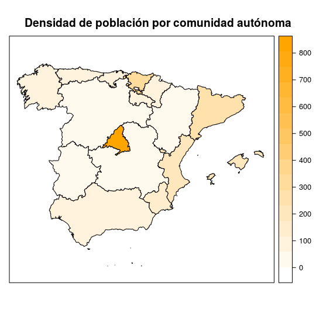

Chropleth maps are a data visualization tool quite used in Social Sciences, this kind of maps represents an administrative unit (countries, states, etc) along with a colour that represents a variable of interest. [Wikipedia](https://en.wikipedia.org/wiki/Choropleth_map) contains a nice article about chropleth maps.

R provides a complete collection of packages to deal with maps in general and chropleth maps in particular: [rworldmap](http://blog.xavier-fim.net/2012/10/using-r-to-draw-maps-on-country-data/), [maptools](http://r-forge.r-project.org/projects/maptools/). Perhaps the most widely used R package to visualize geographical data is ggplot, but lattice also ofers a much simpler method to plot maps.

Many ideas and code exposed in this note were taken from [Making maps in R](http://www.nickeubank.com/wp-content/uploads/2015/10/RGIS3_MakingMaps_part1_mappingVectorData.html#controlling-extent) and [Visualizing data with R](http://www.xavigimenez.net/blog/2012/09/visualizing-data-with-r/).

# Preliminary steps
In first place we need some libraries and data to visualize, in this case we will visualize the population density in Spain and absolute population in Spanish regions, to this end we first load our data:


library(sp)

data = read.table(text=" 
    'Comunidad' 'density' 'population' 
    'Andalucía' 96 8409657 
    'Aragón' 28 1317076 
    'Cantabria' 109 581477 
    'Castilla-La Mancha' 26 2040379 
    'Castilla y León' 26 2435797 
    'Cataluña' 232 7441176 
    'Ceuta y Melilla' 6000 170000 
    'Comunidad de Madrid' 807 6475872 
    'Comunidad Foral de Navarra' 62 640502 
    'Comunidad Valenciana' 212 4934993 
    'Extremadura' 26 1077715 
    'Galicia' 92 2710607 
    'Islas Baleares' 231 1150839 
    'Islas Canarias' 289 2154905 
    'La Rioja' 62 312647 
    'País Vasco' 300 2167707 
    'Principado de Asturias' 98 1034449 
    'Región de Murcia' 130 1472949", header=TRUE)


That simply creates a data table with the region name, population density and population.

# Map loading

Perhaps the most tricky topic in plotting maps is that you need a map first. There are many souces to find maps and the package rwordmap comes with a word map which simplies the plotting process. A good source of european maps is [Eurostat](http://ec.europa.eu/eurostat/web/nuts/overview). In our case we will use [GADM](http://www.gadm.org/), a terrific database with lots of administrative areas maps in several formats. We have used the [map of Spain in R format](http://www.gadm.org/download), maps in GADM comes with different levels of details, in this case we have selected the level 1, corresponding to the Spanish autnomous regions, in case you were interested in getting the map at a province level, level 2 should be your choice. The is a direct link to the map [here](ESP_adm1.rds).

The map is a R object stored in RDF, so reading it from R is straitforward with the sp package.


spain <- readRDS("ESP_adm1.rds")


The structure of the dataframe is quite complex (as you can obverve with a inspection str(spain)). Right now you only should know that there is a column named NAME_1 containing the region name at level 1 (region, in this case). Similarly, the dataframe contains a column NAME_0 storing the region name at level 0 (the country, in this case Spain for all the instances). 

Another tricky task is merging geopraphical data with our data. In our case this step is quite simple, but in a more realistic scenario it would need some coding. To merge data we need to add new columns to the dataframe with our data, take into account that the order of our data determines to which region it is going to be mapped.


spain$density = as.numeric(data$density)
spain$population = as.numeric(data$population)


# Plot parameters
In order to get a nice customized map, we need to set up some parameters first. We begin defining a customized colour palette with 32 colours from white to orange.


colorPalette <- colorRampPalette(c("white", "orange"))(32)


By default, Lattice will zoom and shift the map to cover the entire region represented in our dataframe. Most likely we will need to customize it in order to get a nicer maps. This is the case of Spain, the Canary Islands are far away from the continental land, so a common practice is to plot it next to the mainland. In our case, we will simply not plot it. Just execute the following lines:


# Change these parameters
scale.parameter = 0.65  # scaling paramter. less than 1 is zooming in, more than 1 zooming out. 
xshift = 4.5  # Shift to right in map units. 
yshift = 4  # Shift to left in map units. 
original.bbox = spain@bbox  # Pass bbox of your Spatial* Object. 

# Just copy-paste the following
edges = original.bbox

edges[1, ] <- (edges[1, ] - mean(edges[1, ])) * scale.parameter + mean(edges[1,]) + xshift
edges[2, ] <- (edges[2, ] - mean(edges[2, ])) * scale.parameter + mean(edges[2,]) + yshift


# Map plotting
Finally we are in position to plot the map, just execute the following code.


spplot(spain, "density", col.regions = colorPalette, col = "black", 
       xlim = edges[1, ], ylim = edges[2, ],
       main="Densidad de población por comunidad autónoma")


Which yield the following map.

The final code is as follows.

Since spplot() is a Lattice function, the usual Lattice parameters can be used. For more information, type ?spplot.

